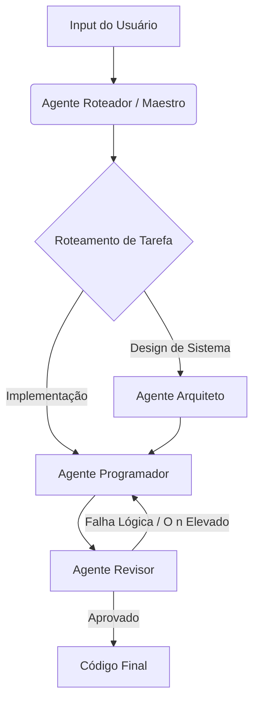

# 🕸️ Graph-MAS-DevEnv (Ambiente de Desenvolvimento Multi-Agente)


## 📌 Visão Geral
Este projeto implementa um **Sistema Multi-Agente (MAS)** local impulsionado por uma arquitetura de grafos direcionados. Em vez de depender de um único prompt monolítico, este ambiente orquestra um *swarm* (enxame) de LLMs de código aberto especializados (executados localmente via Ollama) para projetar, escrever e rever código de forma colaborativa e autônoma.

Ao modelar as interações dos agentes como nós e arestas, o sistema resolve lógicas complexas iterativamente, depura arquiteturas de programação paralela e otimiza a performance do código.

## 🧠 Arquitetura em Grafo

O fluxo de trabalho opera como uma máquina de estados finitos. Cada agente representa um nó no grafo. A transição entre os nós é condicional, permitindo ciclos rigorosos de revisão de código até que a solução cumpra os padrões de complexidade estrutural exigidos.



## 🤖 O Enxame de Agentes (Agent Swarm)

O sistema foi desenhado para maximizar a eficiência de hardware em máquinas locais avançadas (otimizado para 16GB de VRAM e 32GB de RAM DDR5), fazendo offload inteligente entre memória de vídeo e memória de sistema:

- **O Maestro (Router):** Llama 3.1 (8B) - Extremamente rápido e determinístico. Lê o estado global do grafo e encaminha o fluxo para o nó correto. Rodando 100% na VRAM.
- **O Programador (Coder):** Qwen2.5-Coder (7B/32B) - Focado puramente em sintaxe, refatoração extrema e pontes entre linguagens (ex: reescrever lógicas de Python para alta performance em C++).
- **O Revisor (Reviewer):** DeepSeek R1 (8B/14B) - Aplica raciocínio algorítmico denso (Chain-of-Thought) para caçar condições de corrida (race conditions) em concorrência paralela e auditar lógicas matemáticas complexas.

## 📂 Estrutura do Repositório

```text
Graph-MAS-DevEnv/
├── agents/                     # Nós do grafo (Arquitetura, Código, Revisão)
├── graph/                      # Lógica direcional e Estado Global (LangGraph)
├── tools/                      # Ferramentas de execução local (Bash, File IO)
├── models/                     # Modelfiles customizados para o Ollama
├── main.py                     # Ponto de entrada do sistema
└── requirements.txt            # Dependências Python
```

## 🚀 Como Começar

### Pré-requisitos

- Ollama instalado e rodando.
- Python 3.10+
- Hardware sugerido: GPU com 16GB VRAM (ex: RTX 5060 Ti ou similar) + 32GB RAM.

### Instalação

1. Clone o repositório:

```bash
git clone https://github.com/seu-usuario/Graph-MAS-DevEnv.git
cd Graph-MAS-DevEnv
```

2. Instale as dependências:

```bash
pip install -r requirements.txt
```

3. Construa os cérebros locais:

```bash
ollama create mas-architect -f models/Modelfile.architect
ollama create mas-coder -f models/Modelfile.coder
ollama create mas-reviewer -f models/Modelfile.reviewer
```

### Uso

Execute o orquestrador principal passando o seu problema de engenharia:

```bash
python main.py "Desenvolva um algoritmo paralelo em C++ para calcular a centralidade de grau em uma rede complexa e crie os bindings para Python usando pybind11."
```

## 🛠️ Stack Tecnológico

- Motor de Inferência: Ollama
- Orquestração de Nós/Arestas: LangGraph (Python)
- Modelos Base: DeepSeek R1, Qwen2.5-Coder, Llama 3.1

## 🤝 Contribuições

Contribuições são bem-vindas! Sinta-se à vontade para abrir uma Issue ou submeter um Pull Request para adicionar novas ferramentas ou agentes ao grafo de desenvolvimento.